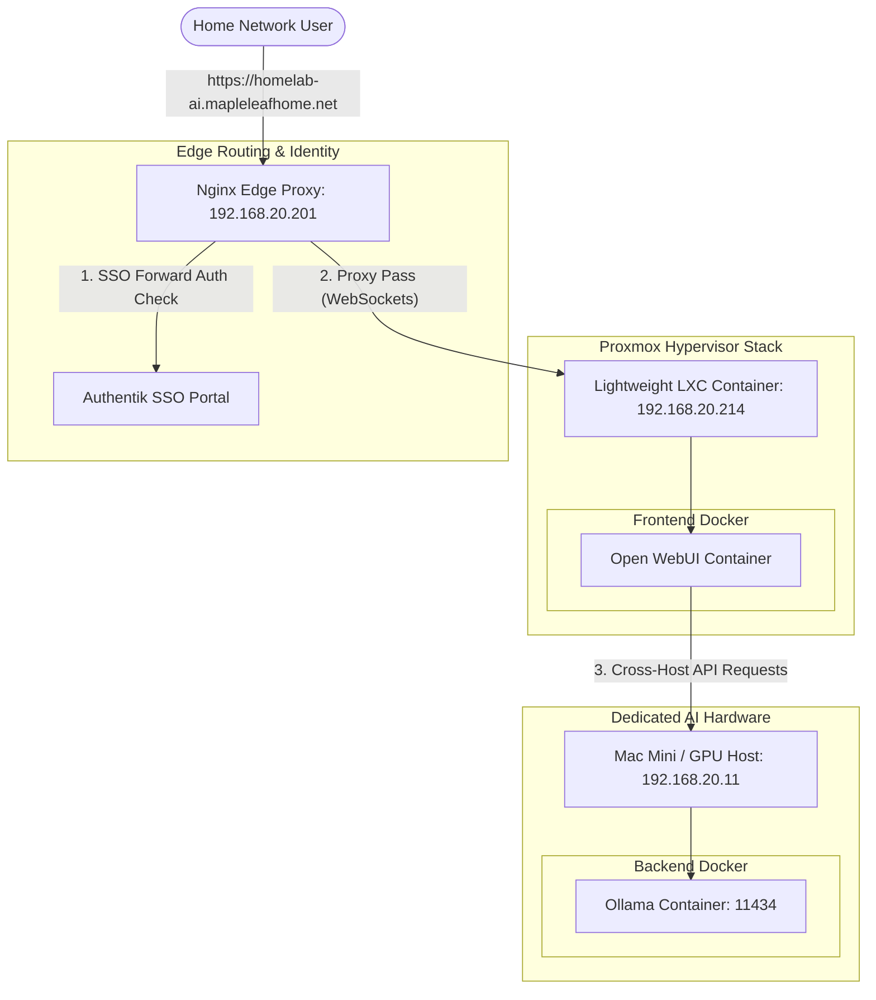

# Homelab AI Stack Architecture & Deployment Guide

This document defines the architecture, deployment options, network routing, and CLI control parameters for the decoupled **Homelab AI** environment.

---

## 🏗️ Architecture Overview

The system splits AI computing into two decoupled layers:
1. **Ollama Engine (Backend)**: Responsible for model management, hardware-accelerated tensor computation, and API serving.
2. **Open WebUI (Frontend)**: Responsible for user authentication, chat state management, and SSE/WebSocket streaming client rendering.

Decoupling these layers allows running resource-heavy inference on capable hardware while placing the web access portal inside a low-resource virtualized Proxmox LXC cluster.

---

## 🧭 Deployment Topologies

### 1. Developer Local Model (Self-Contained - Dockerized)

Used for local development and testing on a single machine running **Docker Desktop** (macOS or Windows). Both containers run locally inside Docker.

```mermaid
graph TD
    subgraph Dev Machine (Docker Desktop)
        subgraph Frontend Container
            UI[Open WebUI]
        end
        subgraph Backend Container
            Ollama[Ollama Engine]
        end
        
        UI -- HTTP Requests --> HostGateway[host.docker.internal:11434]
    end
    
    HostGateway -- NAT Forwarding --> Ollama
    User([Developer Browser]) -- http://localhost:3000 --> UI
```

---

### 2. Native macOS Model (Self-Contained - Non-Dockerized Backend)

**Recommended for Apple Silicon Mac hosts.** Because Docker Desktop runs inside a lightweight Linux hypervisor VM on macOS, Docker containers cannot directly access Apple's native GPU/Metal Framework, causing slow CPU-only or bottlenecked inference.

Running Ollama **natively** on macOS gives it direct access to Apple Silicon unified memory and GPU acceleration, while keeping Open WebUI running inside Docker for easy deployment.

```mermaid
graph TD
    subgraph Mac Host OS (Native macOS)
        subgraph Native Processes
            Ollama[Native Ollama Service: 11434]
        end
        
        subgraph Docker Desktop VM
            subgraph Frontend Container
                UI[Open WebUI]
            end
            UI -- HTTP Requests --> HostGateway[host.docker.internal:11434]
        end
        
        HostGateway -- Host Loopback --> Ollama
    end
    
    User([Developer Browser]) -- http://localhost:3000 --> UI
```

---

### 3. Distributed Homelab Model (Production)

Our permanent, production deployment. The frontend and backend run on physically separate hardware on the LAN.



---

## 🌐 Network Routing & `host.docker.internal`

### The Loopback Dilemma
Inside any Docker container, `localhost` (or `127.0.0.1`) resolves **internally to that specific container**. 

If the Open WebUI container is configured with `OLLAMA_BASE_URL=http://localhost:11434`, it will try to find Ollama running inside its own container shell and fail.

### What is `host.docker.internal`?
On Docker Desktop for Mac and Windows, **`host.docker.internal`** is a special DNS name that resolves to the host machine's loopback IP address (typically `192.168.65.2` or similar internal bridge). 

### When to use it
Use `http://host.docker.internal:11434` when **both** layers are running on the **same machine** (either fully dockerized, or with a native macOS Ollama installation).
- The frontend routes requests out to the host loopback.
- The host forwards the request to port `11434` where either the native macOS app or the docker-mapped backend is listening.

*Note: For the distributed Proxmox homelab setup, we bypass this by using the explicit host LAN IP address (`http://192.168.20.11:11434`).*

---

## 🛠️ Makefile Guide

The root [Makefile](../Makefile) provides targets to control either individual components, the native daemon, or the entire stack:

### 1. Combined Stack (Dockerized local testing)
- **`make up`**: Runs `backend-up` followed by `frontend-up`. Starts both containers.
- **`make down`**: Stops both containers and removes the associated compose networks.
- **`make logs`**: Tails logs for both frontend and backend concurrently in parallel streams.
- **`make clean`**: Shuts down both services and deletes all persistent volume data.

### 2. Standalone Backend (AI Host / Mac Mini)
- **`make backend-up`**: Launches the Ollama service container.
- **`make backend-down`**: Stops the Ollama service container.
- **`make start-backend`**: Launches Ollama, waits for the API to initialize, and runs `make pull-model` to download the configured default LLM.
- **`make pull-model`**: Pulls the model specified by `DEFAULT_MODEL` in `.env` (or overrides it using `NAME`, e.g., `make pull-model NAME=llama3`).

### 3. Standalone Frontend (Proxmox LXC Container)
- **`make frontend-up`**: Prompts the user to verify/enter the backend URL:
  ```text
  Enter Ollama Backend URL [default: http://host.docker.internal:11434]: 
  ```
  Pressing **Enter** uses the developer default. In the homelab production, our Ansible playbook writes this to `.env` dynamically so that the system runs non-interactively.
- **`make frontend-down`**: Stops the Open WebUI container and removes its network.

### 4. Native macOS Targets (Non-Dockerized)
- **`make mac-install`**: Automatically installs Ollama natively on macOS using Homebrew Cask.
- **`make mac-start`**: Opens the native `Ollama.app` (if installed) or spawns the CLI background daemon (`ollama serve`), waits for responsiveness, and downloads the default model.
- **`make mac-stop`**: Gracefully terminates the desktop GUI app using AppleScript and stops the background CLI daemon.
- **`make mac-pull`**: Pulls a model natively to your Mac host (Usage: `make mac-pull NAME=model_name`).
