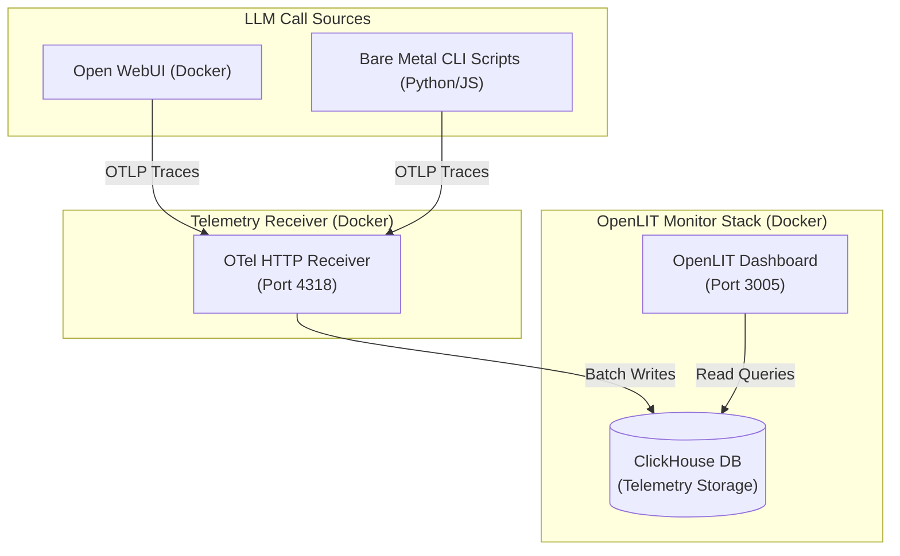

# LLM & GenAI Monitoring with OpenLIT

This directory explains how to configure and run **OpenLIT** to monitor your `homelab-ai` stack (both Open WebUI frontend and Ollama backend).

OpenLIT is an OpenTelemetry-native monitoring and auto-instrumentation platform built specifically for Large Language Models. It collects request metrics (latency, prompt and completion tokens, costs) and system metrics (GPU utilization, memory), and visualizes them in a tailored dashboard.

---

## 1. Running the Monitoring Stack (Docker Compose)

The OpenLIT platform runs as a Docker container backend, backed by ClickHouse for high-performance telemetry storage.

### Start the Monitoring Services
Run the following target to pull ClickHouse and OpenLIT, configure them, and start them in the background:
```bash
make monitor-up
```

* **Dashboard URL:** [http://localhost:3005](http://localhost:3005) (configured to port `3005` to avoid conflicts with Open WebUI's default port `3000`).
* **Default Username:** `user@openlit.io`
* **Default Password:** `openlituser`

### Stop or Clean the Stack
* **Stop monitoring:** `make monitor-down`
* **Wipe logs and volumes:** `make monitor-clean`
* **Tail logs:** `make monitor-logs`

---

## 2. Option A: Monitoring Dockerized Open WebUI (SSO / Web Front-end)

Open WebUI has native support for OpenTelemetry. To tell Open WebUI to forward LLM prompt/response traces and performance data to the local OpenLIT collector:

1. Open `.env` in the root of the repository.
2. Toggle OpenTelemetry to `true`:
   ```env
   ENABLE_OTEL=true
   ```
3. Ensure the collector endpoint matches the local host's OTel HTTP receiver (defaults to `http://host.docker.internal:4318`):
   ```env
   OTEL_EXPORTER_OTLP_ENDPOINT=http://host.docker.internal:4318
   ```
4. Start/Restart the frontend:
   ```bash
   make up
   ```

When users make queries in Open WebUI, traces will stream instantly to the OpenLIT dashboard at `http://localhost:3005`.

---

## 3. Option B: Monitoring Bare-Metal macOS Ollama (CLI / Scripts)

If you are running Ollama natively on macOS bare metal (e.g. using `make mac-start` to run on Apple Silicon M4) and writing scripts or applications to interact with it, you can auto-instrument your code using the OpenLIT SDK.

### Python Auto-Instrumentation
1. Install the OpenLIT SDK in your project's virtual environment:
   ```bash
   pip install openlit
   ```
2. Initialize OpenLIT at the start of your script, pointing to the local collector running on Docker port `4318`:
   ```python
   import openlit
   import ollama

   # Initialize OpenLIT
   openlit.init(
       otlp_endpoint="http://localhost:4318"
   )

   # Your existing Ollama queries will now be automatically traced
   response = ollama.chat(
       model='qwen2.5-coder:7b',
       messages=[{'role': 'user', 'content': 'Write a binary search algorithm in python.'}]
   )
   print(response['message']['content'])
   ```

### Node.js / TypeScript Auto-Instrumentation
1. Install the SDK:
   ```bash
   npm install openlit
   ```
2. Initialize it in your entrypoint:
   ```javascript
   import openlit from 'openlit';
   
   openlit.init({
     otlpEndpoint: "http://localhost:4318"
   });
   ```

---

## 4. How the Telemetry Pipeline Works


